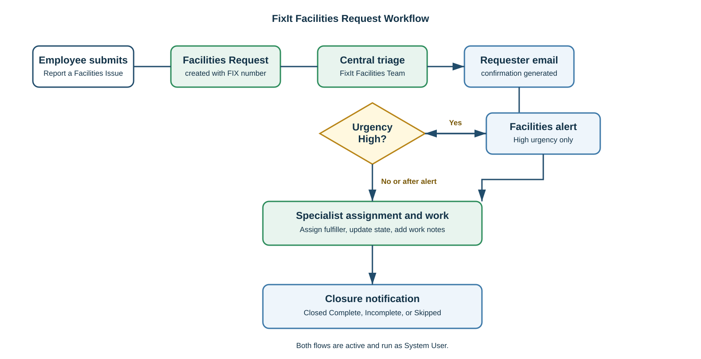
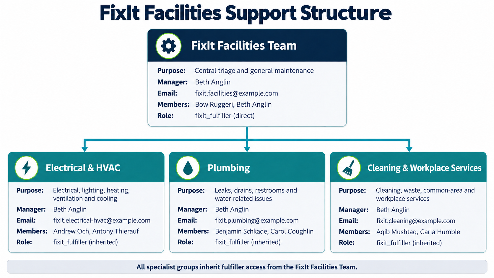

# FixIt: Workplace Facilities Requests

I built FixIt as a ServiceNow App Engine Studio application for managing workplace facilities issues in one clear process.

Employees submit a request through a simple catalog form. Facilities staff triage it, assign the right team member, and close it after recording work notes. I've kept the workflow focused so it is easy to follow and test.

I designed it around a process I could demonstrate end to end. I wanted requesters to have a short form while Facilities staff have a clear queue. I kept specialist routing manual because a triage review still needs context. I built and tested it in a PDI, so I've been clear about what was verified. I didn't connect it to an external email service.

## What it does

- Creates a numbered Facilities Request from a Record Producer.
- Captures issue type, affected area, description, and urgency.
- Routes every new request to the FixIt Facilities Team for central triage.
- Sends a confirmation to the requester.
- Sends an extra alert for High urgency requests.
- Lets facilities staff update and close requests.
- Sends a closure email when a request is closed complete, closed incomplete, or closed skipped.

## Workflow

## Roles and support teams

| Role or group | Purpose |
| --- | --- |
| `fixit_user` | Creates and reads Facilities Requests. |
| `fixit_fulfiller` | Creates, reads, and updates requests. Delete access is not granted. |
| FixIt Facilities Team | Central intake and triage. |
| Electrical & HVAC | Electrical, heating, cooling, and ventilation work. |
| Plumbing | Leaks, drainage, restrooms, and water-related work. |
| Cleaning & Workplace Services | Cleaning, furniture, and common-area work. |

## Tested scenarios

| Scenario | Evidence | Result |
| --- | --- | --- |
| Normal request | Medium-urgency plumbing request | Routed to central triage and requester email generated. |
| High-urgency request | Electrical request, urgency High | Routed to central triage; requester confirmation and facilities-team alert generated. |
| Completed work | High-urgency request closed complete | Closure notification generated for the requester. |
| Incomplete work | Heating/cooling request closed incomplete | Closure notification generated with the final status. |
| Access control | Requester and fulfiller views | Requester is read-only; fulfiller can update but cannot delete. |

I checked generated email records and previews in the Personal Developer Instance Outbox. This project does not claim delivery to external mailboxes.

Screenshot placement is documented in the [evidence guide](evidence/README.md).

## Technology

- ServiceNow Personal Developer Instance
- App Engine Studio
- Task-extended custom table
- Record Producer
- Flow Designer / Workflow Studio
- Roles, assignment groups, and manual test evidence

## Project notes

- All people, email addresses, and requests are fictional sample data.
- It is a portfolio project, not a production deployment.
- A concise [as-built process blueprint](docs/01-discovery-and-process-blueprint.md) documents the design and test boundaries.
