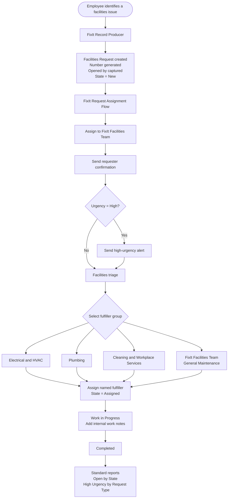

# FixIt: Enterprise Workplace Operations

## Document control

| Item | Value |
| --- | --- |
| Status | Draft - agreed scope, before build |
| Environment | ServiceNow Personal Developer Instance (PDI) |
| Application scope | New scoped application: `FixIt` |
| Data classification | Fictional sample data only |
| Owner | Abul Mohsin |

## 1. Business problem

FixIt House, Dublin currently receives workplace-facilities requests by email, phone, and informal conversations. This creates lost requests, unclear ownership, inconsistent treatment of urgent issues, and no reliable operational reporting.

FixIt will provide one controlled place for employees to report a workplace issue and for Facilities teams to assign, work, communicate, and complete it.

## 2. Business objective and success measures

### Objective

Create a simple, auditable facilities request service for one workplace location.

### Success measures for the demonstration

- A requester can submit a Facilities Request without directly editing the underlying table.
- Every request receives a generated number, captures the logged-in requester, and is assigned to the FixIt Facilities Team.
- A High urgency request creates the required additional alert.
- A fulfiller can assign, document, and complete the request using the required lifecycle.
- The manager can see open, high-urgency, and ageing work using reports.
- Access is restricted according to the approved role model.

## 3. Scope

### Required mentor scope

- Scoped FixIt application and supplied logo.
- Facilities Request table extending Task.
- Required fields, form layout, and state lifecycle: New -> Assigned -> Work in Progress -> Completed.
- FixIt Facilities Team, including Beth Anglin as a fulfiller.
- Record Producer and FixIt Request Assignment flow.
- Normal- and high-urgency tests, plus a completed-request demonstration.

### Approved Operational MVP extension

- Clear requester, fulfiller, and Facilities Manager responsibilities.
- Three specialist Facilities groups: Electrical & HVAC, Plumbing, and Cleaning & Workplace Services.
- Manual specialist triage after the required central FixIt Facilities Team assignment.
- Description mandatory on every request.
- Professional requester-confirmation and high-urgency alert wording.
- Two standard reports: Open Facilities Requests by State; High-Urgency Requests by Request Type.
- Manual test evidence and a professional evidence pack.

### Out of scope for MVP

- Multi-site location selection.
- Procurement, budget approvals, vendor integration, real external email delivery, mobile app, and AI.
- ATF, scripted ACLs, client scripts, custom routing engines, extra custom tables, Playbooks/Process Automation Designer, Performance Analytics, integrations, AI, and production deployment claims.

## 4. Stakeholders and users

| Stakeholder/persona | What they need |
| --- | --- |
| Employee requester | A short form, acknowledgement, and visibility of their own request. |
| FixIt Facilities Team | A central queue to triage and own every new request. |
| Specialist Facilities fulfiller | Work assigned by request type, internal work notes, and clear state progression. |
| Facilities Manager | Visibility of workload, high urgency work, ageing requests, and exceptions. |
| ServiceNow Platform Owner | A scoped, secure, maintainable configuration with evidence of testing. |

## 5. Facilities operating model

| Group | Primary responsibility | Initial request types |
| --- | --- | --- |
| FixIt Facilities Team | Central intake, triage, and default assignment | All new requests |
| Electrical & HVAC | Electrical safety, power, heating, cooling, ventilation | Electrical; Heating/Cooling |
| Plumbing | Water, drainage, toilets, leaks | Plumbing |
| Cleaning & Workplace Services | Cleaning, furniture, room readiness | Cleaning; Furniture |
| Facilities Management | Exception management, high-urgency review, operational reporting | Management persona only; no separate group configuration in MVP |

## 6. End-to-end process blueprint



```text
Employee identifies a workplace issue
        |
        v
Submit FixIt Record Producer
  - Request Type
  - Area
  - Description
  - Urgency
        |
        v
Facilities Request created
  - unique number generated
  - Opened by set to logged-in requester
  - State = New
        |
        v
FixIt Request Assignment Flow
  1. Assign to FixIt Facilities Team
  2. Send requester confirmation
  3. If Urgency = High, send team alert
        |
        v
Facilities triage
  - review request completeness and urgency
  - assign specialist fulfiller/group where appropriate
  - State: New -> Assigned
        |
        v
Work and updates
  - fulfiller documents internal work notes
  - State: Assigned -> Work in Progress
        |
        +--> information missing? return to triage / update requester
        |
        v
Completion
  - work completed and notes recorded
  - State: Work in Progress -> Completed
        |
        v
Facilities Manager reviews operational reports
  - open work, high urgency work, ageing, demand trends
```

## 7. Automation boundary

The process blueprint above is the design artefact used for stakeholder review. The mentor-required automation will be implemented as the **FixIt Request Assignment** flow in Flow Designer/Workflow Studio.

The first working version must always demonstrate the mentor-required assignment to the FixIt Facilities Team. Facilities staff then perform the human triage decision and select a specialist assignment group. This is intentional: the employee's request type is useful information, but it does not always establish the correct trade, urgency, access requirements, or ownership without review.

The central Facilities team and three specialist groups are included in the application design. Only the FixIt Facilities Team requires a named PDI member for the mentor scenario. The specialist groups are fictional operating groups used to demonstrate realistic assignment options, not a claim of a production team structure. Facilities Management is represented as a manager persona for report review rather than an additional configured group in the MVP.

## 8. PDI feasibility and design decisions

| Decision | Outcome | Rationale |
| --- | --- | --- |
| Scoped App Engine Studio application | In scope | AES is available in the PDI and is the mentor-required build approach. |
| Facilities Request extending Task | In scope | Task extension provides the required assignment, state, work-note, and auto-number capabilities. |
| Record Producer | In scope | It creates a simplified requester experience while inserting a record into the custom Task-extended table. |
| FixIt Request Assignment Flow | In scope | Standard low-code automation: assign the central group, send requester confirmation, and branch for High urgency. |
| Specialist routing | Manual triage in MVP | The three specialist groups are selectable after central triage. This is more credible than a large, untested routing engine and preserves the mandatory central-assignment flow. |
| Email evidence | Generated email records / Flow test evidence | PDI work must not claim that messages were delivered to real external recipients. |
| Automated Test Framework (ATF) | Future learning enhancement | Not included because it has not yet been covered in the learning programme. Manual test evidence is the MVP test baseline. |
| Reporting | Two standard reports | Demonstrates operational visibility using fictional sample requests; does not claim real business performance. |
| Process Automation Designer / Playbooks | Out of scope | Requires additional activation and does not improve the mentor-required request-and-assignment flow. |
| Performance Analytics, vendor integration, mobile, AI | Out of scope | May need additional entitlement or creates unneeded complexity for the portfolio MVP. |

### State ownership decision

The Record Producer creates a request in **New** state. The assignment Flow assigns the FixIt Facilities Team but does not automatically claim that triage has occurred. A Facilities fulfiller changes the state to **Assigned** after review, then moves it to **Work in Progress** and **Completed** as work is carried out. This preserves the required lifecycle and makes accountability visible.

## 9. Documentation and evidence standard

For every build increment, record the following before calling it complete:

1. Requirement or user story being implemented.
2. Configuration location and change made.
3. Screenshot of the completed configuration.
4. Test case, expected result, actual result, and pass/fail outcome.
5. Any limitation, defect, or deviation from the plan.
6. Update set/application version information.

Store screenshots under `evidence/` using a descriptive, ordered filename, for example: `02-table-fields.png` or `07-high-urgency-flow-test.png`.

## 10. Build gate

Do not create the application until this blueprint is accepted. After acceptance, create the scoped FixIt app from scratch, then record the app scope and initial role choices in the build log.
